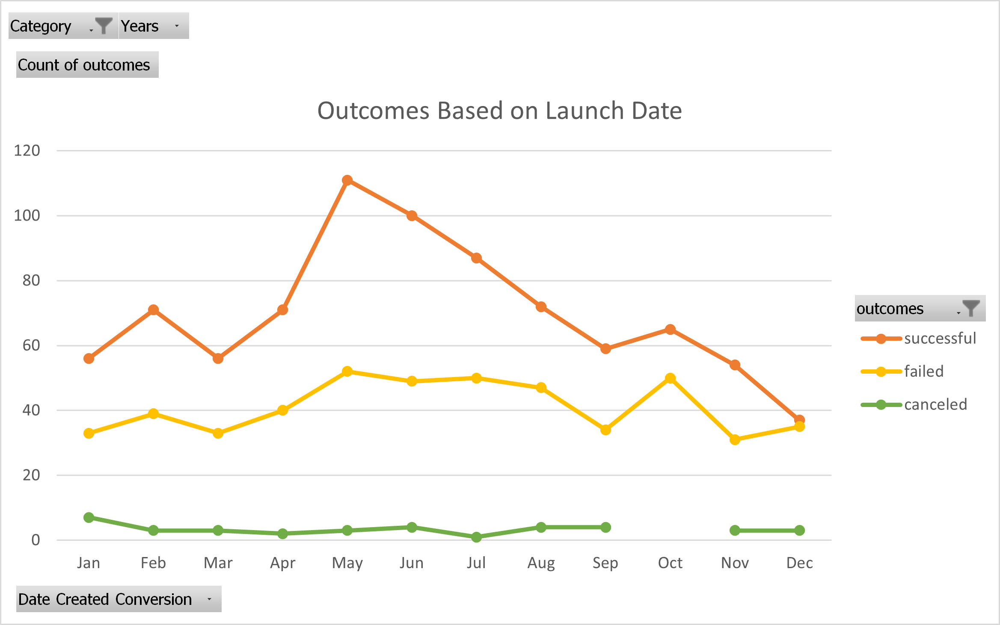
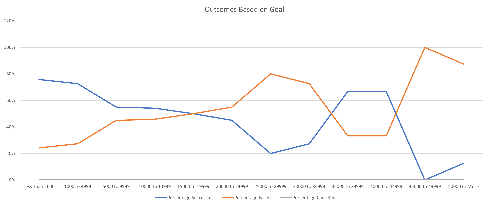

# Kickstarting with Excel
Performing analysis on Kickstarter data to uncover trends
## Overview of Project
Kickstarter, founded in 2009, is a web-based platform that allows creatives to crowdfund for their projects. This project investigates success-failure trends in past Kickstarter projects, with an emphasis on theater. 
### Purpose
The purpose of this project is to assist a playwright in understanding the potential impacts of launchdate and funding goals on her campaign's potential success. 
## Analysis and Challenges
The given data set required additional wrangling and cleaning prior to analysis. In order to better organize the given data, the following changes were made:
* Campaign start and end dates were given in UNIX time codes. These were converted to a more usable format (MM/DD/YYYY), and the year the campaign was iniated in was isolated for further evaluation. 
* The percentage of each campaign's funding goal that they raised was calculated, hereby referred to as "percentage funded". 
* The average donation per backer was calculated for analysis. 
* Various portions of data, including campaign success outcomes and percentage funded achieved were color-coded to aid in quick visual evaluation. 
* Initial data set contained a category called "Category and Subcategory" were separated into two columns, named "Parent Category" and "Subcategory" to aid in analysis. 
### Analysis Based on Launch Date
The focus of this analysis was to investigate if the launch date could impact whether or not a campaign would reach its funding goal. 
The given campaign start dates were converted from UNIX time stamps to standard formatting. The year the campaign was started in was isolated into its own column. A pivot table was created, visualizing the sums of each potential outcome that occurred every month, as well as the total of all campaigns attempted per month. This table was able to be filtered by category and by years. The data was then filtered by category "Theater".

### Analysis of Outcomes Based on Goals
The focus of this analysis was to investigate if the size of the goal fund could impact whether or not a campaign would reach its funding goal. 
A new table was created, delineating the categories of funding goals. The number of plays in each goal category were counted based on their success/failure/cancellation, and the percentages of each success/failure/cancellation were calculated.

### Challenges and Difficulties Encountered
Personally, my biggest challenge was getting the pivot tables situated correctly. I'm used to manually creating tables because I like the level of control that it gives me over formatting, so trying to use the pivot table function could get frustrating sometimes. Once I figured out how to get everything situated (after practicing), I felt a little bit better about the whole process.  
One of the biggest challenges that could potentially hinder someone trying to manage this data is all of the manual work that went into it. In particular, setting up the table for the Outcomes vs. Goals portion required more manual data input than the Launch Date portion, simply because the Goals portion couldn't be created using a pivot table. This opens up the analyst to a host of potential user errors that could cause issues.  
Another potential challenge would be visualizing the data itself. If an analyst is not careful in setting up their tables, there's always the potential for the software to mistakenly flip the chart in the wrong direction, and displaying the incorrect data on the incorrect graph axis. While this would be an easy fix, it might cause an issue for some. 
## Results
### Conclusions
In regards to launch date, two major conclusions can be drawn. First, campaigns started in May had the greatest success rate. Second, campaigns started in December had the lowest success rate. This indicates that the best time to start a campaign would be May, and the poorest would be December.  
In regards to funding goals, we can conclude that funding goals ranging from <$1,000 to $14,999 had the highest rate of success.  
Combining these two conclusions together, it can be concluded that a campaign started in may with a funding goal of >$15,000 will have the highest chance of success.  
### Limitations
The major limitation of this dataset is that the data itself is old. Even with the most detailed data set in the world, there's nothing telling us what has been funded recently. With all of the economic shifts that have occurred in recent years, it would be important to see how those changes have impacted the outcomes of different Kickstarter campaigns.  
Another major limitation is that the genres of the plays are not available. Are comedies more likely to succeed than tragedies? There's no way of knowing. Having that information could prove useful in planning a succesful campaign. 
### Further Study
Another potentially useful visual would be the impact of goal currency on the success of the campaign. Since each country has it's own individual economy and currency, it would be interesting to see if that division would result in a different success rate. Graphing the success rates of campaigns against the currency they chose could potentially show whether a relationship exists or not.  
